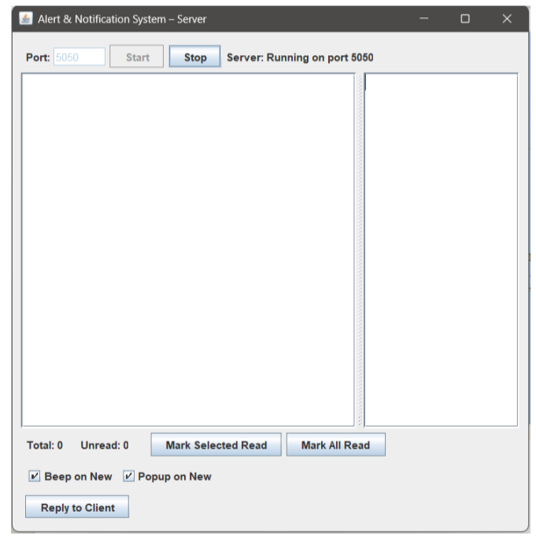
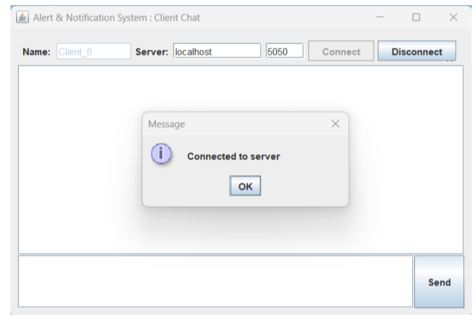
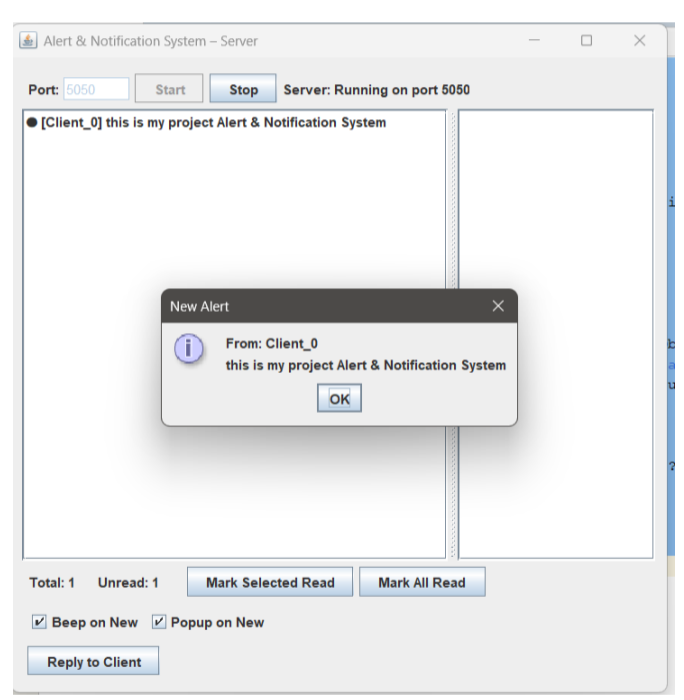
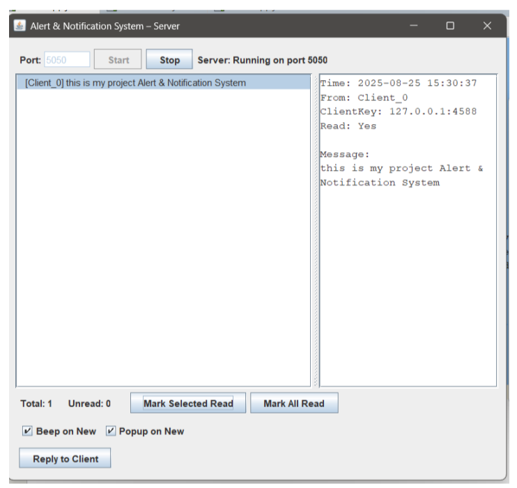
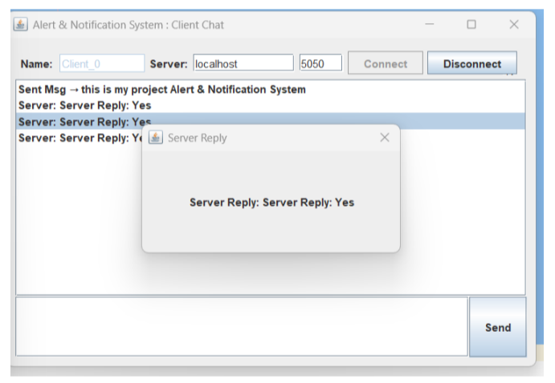
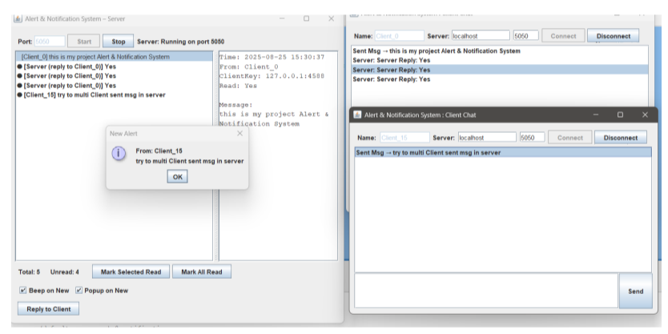

# 🔔 Alert & Notification System

A multi-threaded client-server messaging and alert management application built with **Java SE**, **Swing GUI**, and **TCP Socket Programming**. Designed for real-time notification broadcasting, status tracking, and direct administrative replies across multiple connected clients.

> 📄 **Project Documentation:** [View Full Lab Report (PDF)](docs/Project_Report.pdf)

---

## 📸 Application Workflow & Screenshots

### 1. System Startup & Connection
| Figure 3.2: Server Started & Running | Figure 3.3: Client Connected to Server |
| :---: | :---: |
|  |  |
| *Server listening on port 5050 with thread pool initialized.* | *Client auto-assigns unique ID and connects to localhost:5050.* |

---

### 2. Alert Transmission & Management
| Figure 3.4: Server Receives Client Alert | Figure 3.5: Server Reading Client Message & Details |
| :---: | :---: |
|  |  |
| *Server receives incoming alert with popup dialog and audio beep.* | *Selecting an alert reveals full timestamp, IP:port key, and updates read status.* |

---

### 3. Direct Replies & Multi-Client Concurrency
| Figure 3.8: Client Receives Server Reply | Figure 3.9: Server Handling Multiple Clients |
| :---: | :---: |
|  |  |
| *Client receives administrative reply with auto-dismissing popup.* | *Concurrent management of multiple clients (Client_0, Client_15) via multi-threading.* |

---

## 🚀 Key Features

### 🖥️ Server Side (`ServerApp`)
- **Port Configuration**: Start and stop listening on any configurable network port (default: `5050`).
- **Thread Pool Architecture**: Uses Java's `ExecutorService` (Cached Thread Pool) to concurrently serve multiple clients without blocking the user interface.
- **Alert Dashboard**:
  - Unread alerts are styled in **bold**, while read alerts appear in plain font.
  - Inspect message metadata: sender identifier, network address key (`IP:Port`), timestamp, and read status.
  - Mark individual items or all alerts as read with live counter updates.
- **Auditory & Visual Notifications**: Toggle system beep alerts (`Toolkit.beep()`) and modal popup notifications on arrival of new messages.
- **Targeted Reply**: Send direct responses back to specific clients via dedicated output streams.

### 💻 Client Side (`ClientApp`)
- **Persistent Client ID**: Automatically generates and increments unique client names (e.g., `Client_0`, `Client_1`, `Client_15`) using a local sequence counter (`client_counter.txt`).
- **Connection Control**: Intuitive interface to connect and disconnect safely from the central server.
- **Message Transmission**: Formats and streams tab-delimited messages (`ClientName \t Message`) through socket streams.
- **Temporary Popups**: Incoming replies trigger an auto-closing popup dialog that dismisses automatically after 3 seconds.

---

## 🛠️ Technology Stack

| Layer | Technology |
|---|---|
| **Programming Language** | Java SE (JDK 8+) |
| **Graphical User Interface (GUI)** | Java Swing & AWT (`JFrame`, `JSplitPane`, `JList`, `BorderLayout`) |
| **Networking** | Java Socket API (`Socket`, `ServerSocket`) |
| **Concurrency & Multithreading** | Java Concurrency API (`ExecutorService`, Thread Pools) |
| **Storage / Persistence** | File-based I/O (`client_counter.txt`) |

---

## 📂 Project Structure

```text
Alert-Notification-System/
├── docs/
│   └── Project_Report.pdf               # Complete academic lab project report
├── screenshots/
│   ├── 01-server-start.png
│   ├── 02-client-connected.png
│   ├── 03-server-alert-received.png
│   ├── 04-server-message-details.png
│   ├── 05-client-reply-received.png
│   └── 06-multi-client-handling.png
├── src/
│   └── com/
│       └── mycompany/
│           └── notification/
│               ├── ClientApp.java       # Client GUI & Socket listener thread
│               └── ServerApp.java       # Server GUI, ClientHandler & Alert model
├── client_counter.txt                   # Stores client sequence count
└── README.md
```

---

## ⚙️ How to Run

### 1. Clone the Repository
```bash
git clone [https://github.com/your-username/Alert-Notification-System.git](https://github.com/your-username/Alert-Notification-System.git)
cd Alert-Notification-System
```

### 2. Compile the Source Code
Compile all Java source files into a target directory (`bin`):
```bash
javac -d bin src/com/mycompany/notification/*.java
```

### 3. Launch the Server
Start the server instance before launching any clients:
```bash
java -cp bin com.mycompany.notification.ServerApp
```
- Keep the default port (`5050`) or enter a custom port, then click **Start**.

### 4. Launch Client(s)
Open a separate terminal window for each client you want to connect:
```bash
java -cp bin com.mycompany.notification.ClientApp
```
- Verify the server address (`localhost:5050`) and click **Connect**.
- Type your message in the input box and click **Send**.

---

## 🔮 Limitations & Future Enhancements

- **Database Integration**: Integrate relational databases (e.g., MySQL or SQLite) to persist message history across server restarts.
- **Security & Encryption**: Implement SSL/TLS socket encryption to safeguard communication against eavesdropping.
- **User Authentication**: Incorporate login credentials and role-based permissions.
- **Modern Interface**: Upgrade legacy Swing components to JavaFX or a modern web-based UI.
- **External Notifications**: Integrate SMS/Email notification gateways for critical alerts.

---

## 👥 Contributors

- **MD MAHABUB HASAN MAHIN** — ID: 231902056
- **MAJAHARUL ISLAM** — ID: 231902050

*Department of Computer Science and Engineering (CSE)*  
*Green University of Bangladesh*  
*Course: CSE 312 - Computer Networking Lab*
